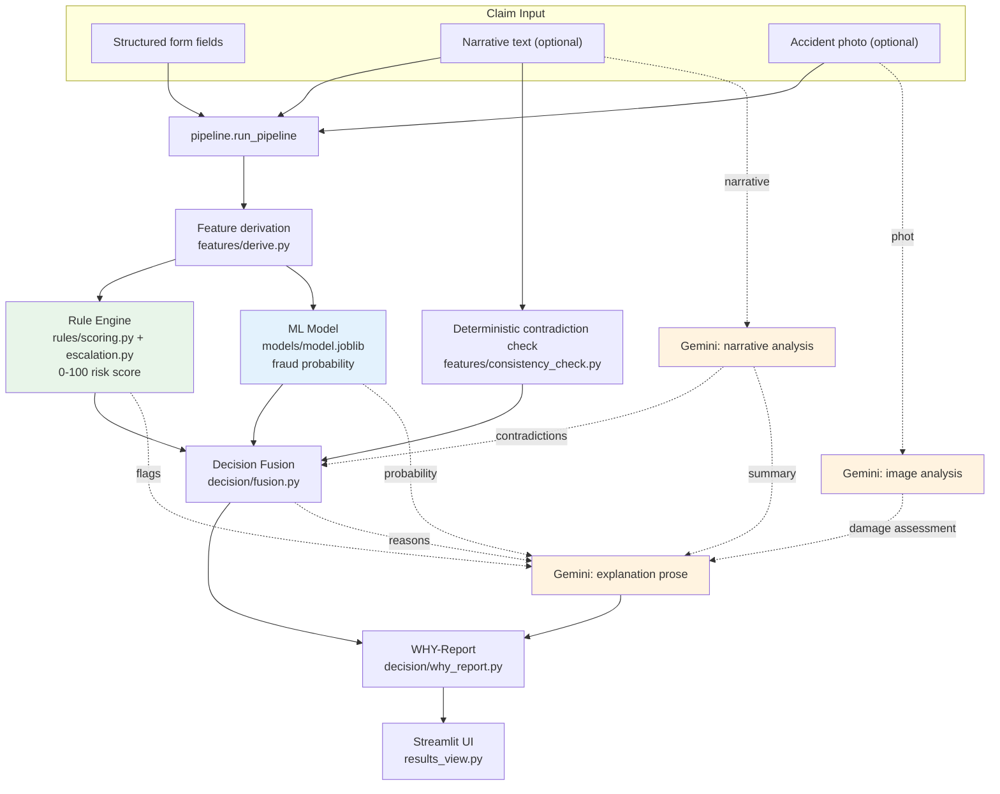
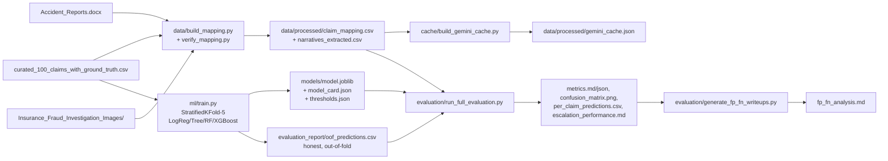

# Architecture Diagram

## Live claim-scoring path (New Claim / Browse Existing Claims pages)

*Green/blue boxes are deterministic and auditable (never call an LLM). Orange boxes are Gemini calls, each
with a documented fallback if unavailable - the system never blocks or crashes without them.*

## Offline training & evaluation path

